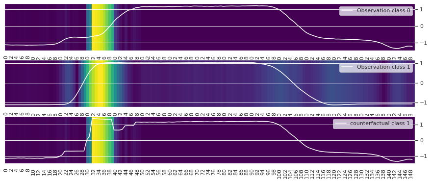

# TSEvo: Counterfactuals for Time Series Classification 
This repository contains the code to out paper "TSEvo: Counterfactuals for Time Series Classification" accepted at ICMLA '22.

With the increasing predominance of deep learning methods on time series classification, interpretability becomes essential, especially in high-stake scenarios. Although many approaches to interpretability have been explored for images and tabular data, time series data has been mostly neglected. We
approach the problem of interpretability by proposing TSEvo, a model-agnostic multiobjective evolutionary approach to time series counterfactuals incorporating a variety of time series transformation mechanisms to cope with different types and structures of time series. 

<p align="center">
    
</p>

TSEvo is now part of the soon-to-come release v0.0.14 of <a href="https://github.com/fzi-forschungszentrum-informatik/TSInterpret">TSInterpret</a>(<a href="https://github.com/fzi-forschungszentrum-informatik/TSInterpret/blob/main/docs/Notebooks/TSEvo_torch.ipynb">notebook </a>).
TSInterpret is a PyPi installable Python library to faciliate the usage of interpretability methods for times series classification and includes the counterfatuals methods used in the benchmark here as well as gradient based and perturbation based methods.

# Installation
To use TSEvo install:
```
pip install .
```
For rerunning the experiments, installing the requirements.txt is necessary.

# Usage
Entry point to TSEvo is ```CounterfactualExplanation.py```. 
```python
from TSEvo.CounterfactualExplanation import Explanation

model = # Your ML Model returning a probability distribution
data = #Additionally available in structure (x,y) 
backend= #'Torch' or 'Tensorflow'

exp = Explanation(model,data,backend)

original_x= # Data to explain
y= # Prediction to explain
target_y= # can be None
transformer= # choice of ['authentic_opposing_information','mutate_both','mutate_mean','frequency_band_mapping']

cf=ep.explain_instance(original_x,y, target_y= None,transformer = 'authentic_opposing_information')

```

For more examples and available plots, refer to the jupyter notebooks.
- For Multivariate Data `Multidimensional_Evo.ipynb`
- For Univariate Data `Univariate_Evo.ipynb`
- Tensorflow: `GunPoint_tensorflow.ipynb`


# Rerun Evaluation
To replicate the results from the paper, please follow the steps below.
## Rerun Training Classification Model
`python Q0_Train_ResNet_UCR_UEA.py`
## Rerun Counterfactual Generation
`python Q1_Run_UCR_UEA.py`

## Rerun Baselines
UCR: `Q2_python Benchmarking_UCR.py`
UEA: `Q2_python Benchmarking_UEA.py`
## Refactor Tables in Visualizations from Paper
Compare Mutation: `python Q1_Eval.py`

Baselines: `python Q2_CalcBaselineDist.py`

`python Q2_Eval.py`

# Citation
```
@inproceedings{hoelligTSEvo2022,
  title = {TSEvo: Evolutionary Counterfactual Explanations for Time Series Classification},
  booktitle = {{{IEEE Conference}} on {{Machine Learning}} and Applications} ({{ICMLA}})},
  author = {Höllig, Jacqueline and Kulbach, Cedric and Thoma, Steffen},
  date = {2022},
}
```
